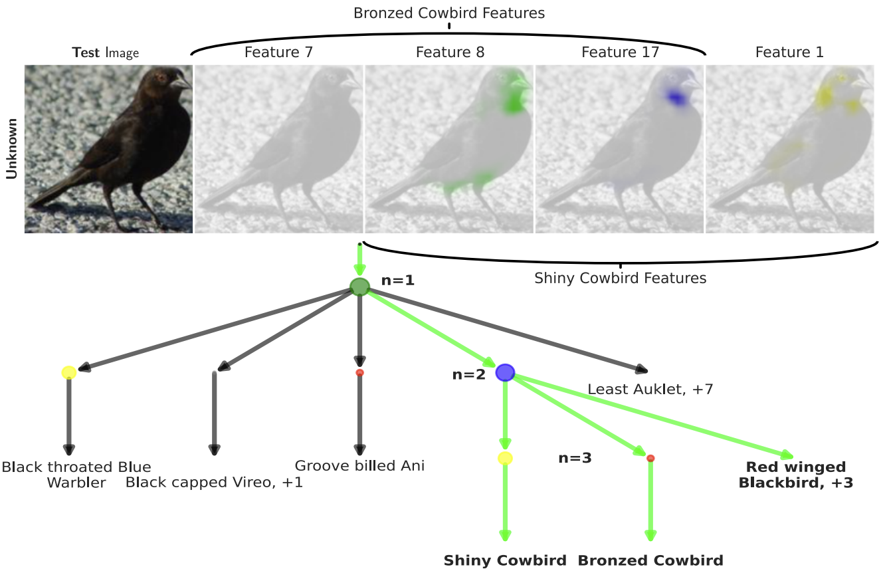
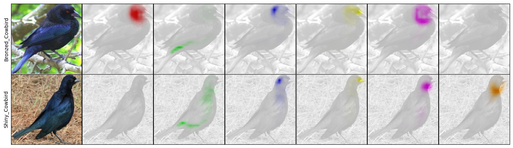
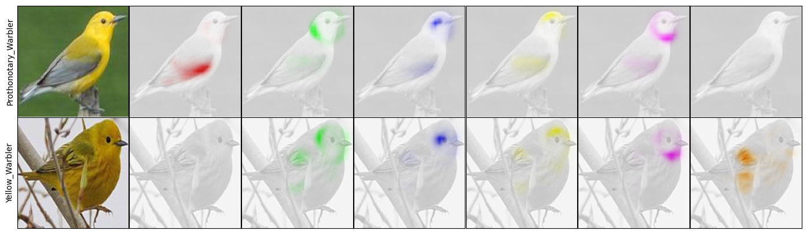
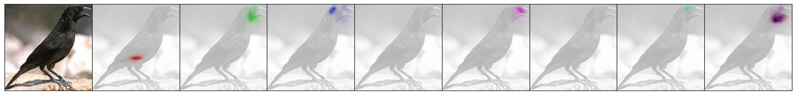
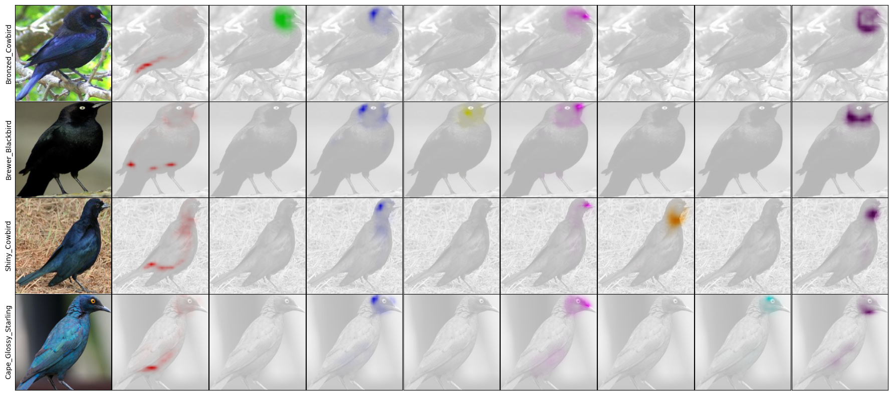
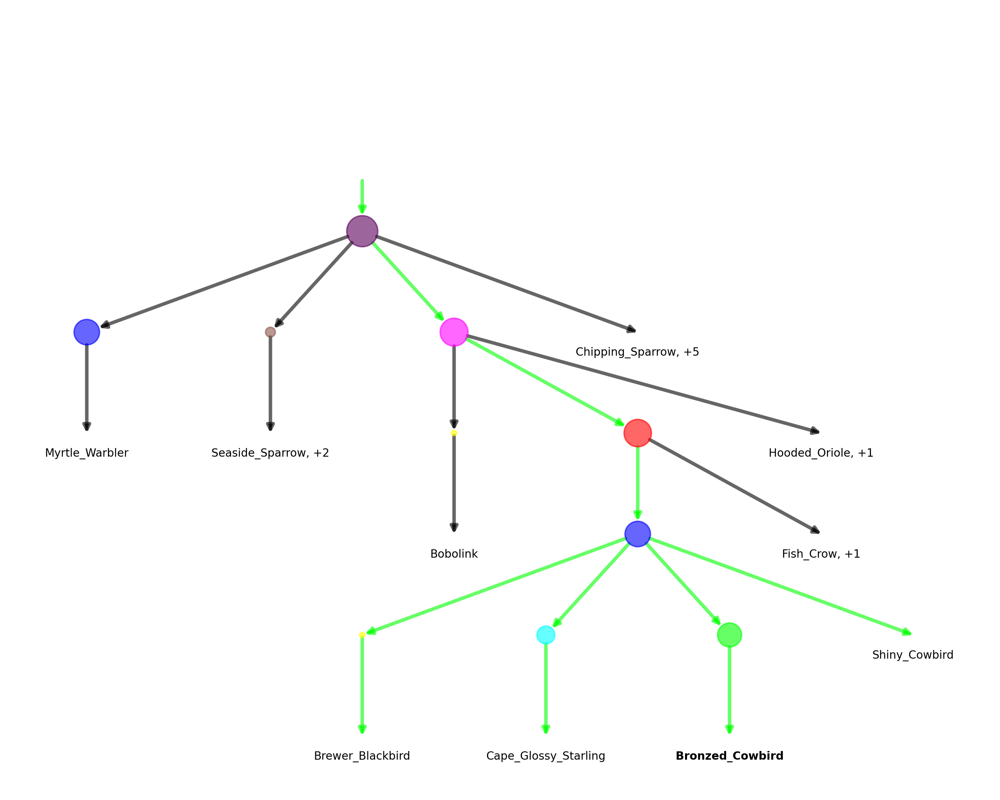

# CHiQPM: Calibrated Hierarchical Interpretable Image Classification

 
This repository contains the code for the NeurIPS 2025 paper
[*CHiQPM: Calibrated Hierarchical Interpretable Image Classification*](https://www.tnt.uni-hannover.de/papers/data/1801/Neurips2025_ChiQPM%20(12)%20(2).pdf) by Thomas
Norrenbrock , 
Timo Kaiser,  Sovan Biswas, Neslihan Kose, Ramesh Manuvinakurike,
and Bodo Rosenhahn.

Additonally, QPM from the ICLR 2025 paper
[*QPM: Discrete Optimization for Globally Interpretable Image Classification*](https://openreview.net/forum?id=GlAeL0I8LX) by Thomas
Norrenbrock , 
Timo Kaiser,  Sovan Biswas, Ramesh Manuvinakurike,
and Bodo Rosenhahn, Q-SENN from the AAAI 2024 paper 
[*Q-SENN: Quantized Self-Explaining Neural Network*](https://ojs.aaai.org/index.php/AAAI/article/view/30145) by Thomas
Norrenbrock , 
Marco Rudolph,
and Bodo Rosenhahn
and the SLDD-model from [*Take 5: 
Interpretable Image Classification with a Handful of Features*](https://arxiv.org/pdf/2303.13166) (NeurIPS 
Workshop) from the same authors is included.
This repository extends [*QPM's*](https://github.com/ThomasNorr/qpm).

<p align="center">
     
</p>

---
Abstract:
>Globally interpretable models are a promising approach for trustworthy AI in safety-critical domains. Alongside global explanations, detailed local explanations are a crucial complement to effectively support human experts during inference. This work proposes the Calibrated Hierarchical QPM (CHiQPM) which offers uniquely comprehensive global and local interpretability, paving the way for human-AI complementarity. CHiQPM achieves superior global interpretability by contrastively explaining the majority of classes and offers novel hierarchical explanations that are more similar to how humans reason and can be traversed to offer a built-in interpretable Conformal prediction (CP) method. Our comprehensive evaluation shows that CHiQPM achieves state-of-the-art accuracy as a point predictor, maintaining 99% accuracy of non-interpretable models. This demonstrates a substantial improvement, where interpretability is incorporated without sacrificing overall accuracy. Furthermore, its calibrated set prediction is competitively efficient to other CP methods, while providing interpretable predictions of coherent sets along its hierarchical explanation.


---

## Installation
You will need the usual libaries for deep learning, e.g. pytorch, 
torchvision, numpy, etc. The quadratic problem is solved using [Gurobi](https://www.gurobi.com/) and requires a license
which is [free for academics](https://www.gurobi.com/academia/academic-program-and-licenses/).
Additionally, 
[GLM-Saga](https://github.com/MadryLab/glm_saga) is used for Q-SENN and SLDD-Model that can be installed via pip.
In case you are lazy (or like to spend your time otherwise), a suitable 
environment can be created using [Anaconda](https://www.anaconda.com/) and the 
provided environment.yml file:
```shell
conda env create -f environment.yml 
```

## Data
Supported datasets are:
- [Cub2011](https://www.vision.caltech.edu/datasets/cub_200_2011/)
- [StanfordCars](https://ai.stanford.edu/~jkrause/cars/car_dataset.html)
- [TravelingBirds](https://worksheets.codalab.org/bundles/0x518829de2aa440c79cd9d75ef6669f27)
- [ImageNet](https://www.image-net.org/)

To use the data for training, the datasets have to be downloaded and put into the 
respective folder under ~/tmp/datasets such that the final structure looks like

```shell
~/tmp/datasets
├── CUB200
│   └── CUB_200_2011
│       ├── ...
├── StanfordCars
│   ├── stanford_cars
│       ├── ...
├── TravelingBirds
│   ├── CUB_fixed
│       ├── ...
├── imagenet
│   ├── ...
```

The default paths could be changed in the dataset_classes or for Imagenet in 
get_data.py

Note: 
If cropped images, like for PIP-Net, ProtoPool, etc. are desired, then the 
crop_root should be set to a folder containing the cropped images in the 
expected structure, obtained by following ProtoTree's instructions: 
https://github.com/M-Nauta/ProtoTree/blob/main/README.md#preprocessing-cub, 
default path is: PPCUB200  instead of CUB200 for Protopool. Using these images 
can be set using an additional flag `--cropGT` introduced later.


## Usage
The code to create a CHiQPM model can be started from the file main.py.
Available parameters are:
- `--dataset`: The dataset to use. Default: Cub2011
- `--arch`: The backbone to use. Default: resnet50
- `--model_type`: The model type to use. Default: chiqpm
- `--seed`: The seed to use. Default: None
- `--do_dense`: Whether to train the dense model. Default: True
- `--cropGT`: Whether to crop CUB/TravelingBirds based on GT Boundaries. Default: True
- `--n_features`: How many features to select. Default: 50
- `--n_per_class`: How many features to assign to each class. Default: 5
- `--img_size`: Image size. Default: 224
- `--reduced_strides`: Whether to use reduced strides for resnets. Default: True


For Example the next command will start the creation of CHiQPM with resnet50 on 
StanfordCars using the default arguments in the paper.
```shell
python main.py --dataset StanfordCars
```


**Note:**
All experiments on ImageNet in the paper skipped the dense training from 
scratch. The pretrained models are used directly.
This can be replicated with the argument --do-dense False.

## Visualizing the results
We also include code to visualize the contrastive class explanations of the trained CHiQPM, loosely building upon [pytorch-grad-cam](https://github.com/jacobgil/pytorch-grad-cam).
This can be done by running the file compare_classes.py with the same arguments used for training.
For the uploaded CHiQPM, e.g. comparisons like this will be saved to the folder "~/tmp/TrainvizQPMClassComparisons":
<p align="center">
     
</p>
<p align="center">
     
</p>
They are similar to Figure  1 of the paper, where the first columns
visualize the feature maps of the upper class and the later columns of the lower class. By default, only classes are
compared which share 4 features, thus only the last and first column  are used to differentiate the classes.

Here, we select the class examples for comparison via heuristics: The samples should be correctly classified, while the used features have high activation and focused on different regions.

Note that the heatmaps transport certainty, as they are scaled based on the active mean of the feature (eqs. 24,25). 

CHiQPM offers the novel hierarchical local explanations, which can be visualized using the file visualize_tree.py.
By default, it is configured to create a local explanation including heatmap and graph  (e.g. Fig. 2)  and a global 
class comparison (e.g. Fig. 1)  for one sample each of the above classes. For example, with the uploaded CHiQPM, calibrated to guarantee 90% accuracy,
these explanations will be created for the test image shown in the local explanation with index 657 and saved to 
~tmp/CHiQPMExplanations/SampleIndex_657/acc_0.9:

Local explanation with the heatmaps showing where the features are activating:
<p align="center">
     
</p>
Global explanation comparing the predicted class Bronzed Cowbird with classes that share multiple features:
<p align="center">
     
</p>
With this hierarchical explanation:
<p align="center">
     
</p>
The top-1 prediction is Bronzed Cowbird, highlighted in bold, while the green path marks the set of classes that are
predicted to ensure 90% accuracy. 

Note that the colorcode for the features is consistent across all images.

## Citations
Please cite this work as:\
CHiQPM
```bibtex
@inproceedings{
2025chiqpm,
title={{CH}i{QPM}: Calibrated Hierarchical Interpretable Image Classification},
author={Thomas Norrenbrock and Timo Kaiser and Sovan Biswas and Neslihan Kose and Ramesh Manuvinakurike and Bodo Rosenhahn},
booktitle={The Thirty-ninth Annual Conference on Neural Information Processing Systems},
year={2025},
url={https://openreview.net/forum?id=jDJUjqUies}
}
```
QPM
```bibtex
@inproceedings{
norrenbrock2025qpm,
title={{QPM}: Discrete Optimization for Globally Interpretable Image Classification},
author={Thomas Norrenbrock and Timo Kaiser and Sovan Biswas and Ramesh Manuvinakurike and Bodo Rosenhahn},
booktitle={The Thirteenth International Conference on Learning Representations},
year={2025},
url={https://openreview.net/forum?id=GlAeL0I8LX}
}
```
Q-SENN
```bibtex
@inproceedings{norrenbrock2024q,
  title={Q-senn: Quantized self-explaining neural networks},
  author={Norrenbrock, Thomas and Rudolph, Marco and Rosenhahn, Bodo},
  booktitle={Proceedings of the AAAI Conference on Artificial Intelligence},
  volume={38},
  number={19},
  pages={21482--21491},
  year={2024}
}
```
SLDD-Model
```bibtex
@inproceedings{norrenbrocktake,
  title={Take 5: Interpretable Image Classification with a Handful of Features},
  author={Norrenbrock, Thomas and Rudolph, Marco and Rosenhahn, Bodo},
  year={2022},
  booktitle={Progress and Challenges in Building Trustworthy Embodied AI}
}
```
## Pretrained Models
One pretrained Resnet50 for CHiQPM on CUB can be obtained via this link: [CHiQPM-WithCrop](https://drive.google.com/drive/folders/1nu_oTH0g8gqz8Qhpe6pqHd7ZhiaK03tV?usp=sharing)

One pretrained Resnet50 for QPM on CUB can be obtained via this link: [QPM-WithCrop](https://drive.google.com/drive/folders/1skvJfzGAqQTm3_eQaTpb7kE_sXnBsm4W?usp=sharing)

One pretrained Resnet50 QPM trained on CUB without the ground truth crop can be obtained via this link: [QPM-NoCrop](https://drive.google.com/drive/folders/1WC8k_vQTdTR0LWxI8zUByn7RPDVhQawc?usp=sharing)

One pretrained Resnet50 for Q-SENN on CUB can be obtained via this link: [Q-SENN-WithCrop](https://drive.google.com/drive/folders/1agWqKhcWOVWueV4Fzaowr80lQroCJFYn?usp=drive_link)

## Acknowledgement


This work was supported by the Federal Ministry of Education and Research (BMBF), Germany,
under the AI service center KISSKI (grant no. 01IS22093C), the Deutsche Forschungsgemeinschaft
(DFG) under Germany’s Excellence Strategy within the Cluster of Excellence PhoenixD (EXC2122),
the MWK of Lower Sachsony within Hybrint (VWZN4219), the European Union under grant
agreement no. 101136006 – XTREME. The work has been done in collaboration and partially funded
by the Intel Corporation. This work was partially supported by the German Federal Ministry of the
Environment, Nature Conservation, Nuclear Safety and Consumer Protection (GreenAutoML4FAS
project no. 67KI32007A).

The work was done at the Leibniz University Hannover and published at NeurIPS 2025.

<p align="center">
     
    
    
</p>
